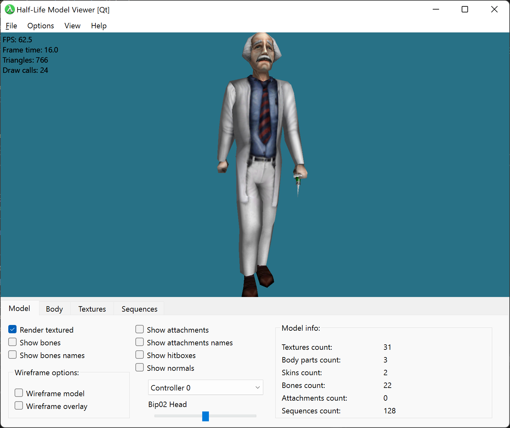

# hlmvqt
Half-Life model viewer written from scratch using Qt 6.

I've decided to make this model viewer after realizing that all existing ones are just slight variations of the original HLMV 1.25 tool by Mete Ciragan.
They work quite bad on modern platforms, exhibit DPI scaling issues and contain long-standing bugs (like inability to view skins if they're in external file).

HLMVQT is a complete re-write from scratch using modern Qt6 framework, so it's able to work on any modern platform (Windows, Linux, MacOS, Android, iOS and so on) as well as not containing any of the old bugs (well, maybe some new though :) )

It's also completely open-sourced and is hosted on GitHub ([https://github.com/iOrange/hlmvqt](https://github.com/iOrange/hlmvqt)) and pull-requests and issues postings are very welcome!

Enjoy!
Sergii 'iOrange' Kudlai